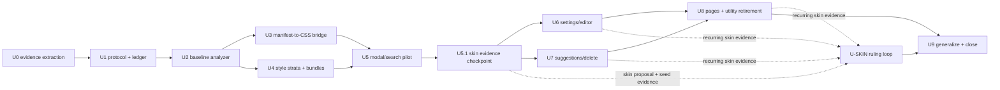

# Monky × Ermine Adoption — Work Orders

> **What this document is.** A sequence of delegated work orders for using Monky as
> Ermine's first real application and, at the same time, extracting a reusable method
> for remodeling an existing project's styles with Ermine.
>
> **Status.** Thread U execution plan. K, A, B, C, and D are already implemented.
> These orders consume those systems; they do not reopen their settled rulings.
>
> **Repositories.** The orders assume sibling checkouts named `ermine/` and `monky/`.
> Unless a step says otherwise, commands are shown from the Ermine repository root and
> the Monky checkout is `../monky`. Never
> assume an uncommitted file in one repository is reproducible evidence for the other:
> record both repository commits in every adoption artifact.

---

## 0. Rules for every executor

These rules apply to every order below. A work order may make them stricter; it may not
relax them.

### U-R1 — Ermine owns grammar decisions

`ermine/constitution/ERMINE.md` is the only normative authority for axes, vocabulary,
composition laws, and emission. Monky may reveal a missing decision; it may not make
one. A missing decision produces a Gap Report, not a new class.

### U-R2 — Monky owns application intent

Monky owns its component identity, product-specific positioning, exact interaction
requirements, and temporary skin residue. Do not force a Monky-specific fact into the
grammar merely to increase the migration percentage.

### U-R3 — Never coin or silently reinterpret

Do not invent an Ermine word, alias, scale step, state, or spelling. Do not preserve an
obsolete Monky spelling while claiming it is Ermine. The proposed class string must
pass Ermine's real `lint()` function.

### U-R4 — Conservation is load-bearing

Every original style declaration in scope must finish with exactly one disposition:

- `grammar-exact`
- `grammar-composition`
- `skin-local`
- `identity-local`
- `substrate`
- `gap`
- `dead`
- `uncertain`

The declaration count before migration must equal the total count across those
dispositions. A declaration may move or become generated; it may never disappear
without an explicit `dead` record and evidence that it had no effect or no consumer.

### U-R5 — Separate cross-repository commits

An order may coordinate both repositories, but each repository gets its own commit.
Commit Ermine infrastructure or rulings first; record that commit in Monky's provenance;
then commit Monky. If a final Ermine report records the Monky result, commit that report
last with the Monky commit ID it measured.

### U-R6 — Derived means generated

Generated CSS, inventories, ledgers, reports, and metadata are never hand-edited. Fix
their source or generator and regenerate. Every generator must have a `--check` mode or
an equivalent no-diff test.

### U-R7 — Preserve dirty work before cleanup

Before changing either repository, record `git status --short`, `git diff --stat`, and
the current commit. Existing user changes are evidence until dispositioned. Do not use
`git reset --hard`, `git checkout --`, or any destructive cleanup command.

### U-R8 — Behavior is part of the baseline

Monky's unit tests, build, and browser style probes must pass after every Monky order.
An intentional visual or computed-style change must be named in the order's report;
otherwise it is a regression.

### U-R9 — Automation accounts and suggests; humans decide

Automation may inventory, classify by known ownership, propose exact mappings, lint,
emit, count residuals, and compare rendering. It may not decide:

- whether an ambiguous style is grammar, skin, or identity;
- whether a number deserves a scale name;
- whether a visual difference is acceptable;
- whether a repeated skin pattern enters Ermine;
- whether a new word is admitted.

Those records remain `uncertain` or become Gap Reports.

### U-R10 — One class namespace, four ownership kinds

Use these naming rules during migration:

| Kind | Rule |
|---|---|
| Ermine grammar | Exact registry word, unprefixed |
| Component identity | Component-qualified selector, e.g. `macro-search__item` |
| Shared Monky skin | `ui-*` recipe until/unless Ermine rules the skin vocabulary |
| State | Platform attribute/pseudo-class first; `data-state` for app-only state |

Ermine theme sockets retain their declared names (`--spacing-*`, `--size-*`). New
Monky-only skin variables use an `--mk-*` prefix.

### U-R11 — No migration-by-search-and-replace

Numeric or implementation-named utilities do not mechanically imply a semantic word.
For example, `gap-2` may map to `gap-snug` only when the project's pinned theme proves
that equivalence and the authoring intent agrees. Every rewrite is ledger-backed.

### U-R12 — Validation commands

Unless an order narrows the scope for an intermediate commit, finish with:

```sh
npm run check
cd ../monky && npm test && npm run build
```

Run each repository's browser suite when the order changes rendered styles or browser
evidence.

---

## 0.1 Gap Report format

Write unresolved design questions in Ermine as
`reports/GAP-U-<order>-<slug>.md`:

```markdown
# Gap Report — U<order>
## What I was doing
<the Monky component and migration step>
## The decision that is missing
<the exact choice not settled by the constitution>
## Where I looked
<Ermine IDs, registry axes, guide sections, Monky selectors and ledger records>
## Options I can see (NOT a recommendation)
<2–4 neutral options>
## What is blocked
<the affected declarations, component, and acceptance criterion>
```

Include occurrence counts and concrete Monky examples when available. Do not recommend
an option in the Gap Report.

---

## 0.2 Adoption ledger contract

The ledger is declaration-level. Its canonical location for this case study is:

```text
ermine/reports/adoption/monky/ledger.json
```

Minimum shape:

```json
{
  "version": 1,
  "project": "monky",
  "source": {
    "ermineCommit": "<40-character commit>",
    "monkyCommit": "<40-character commit>"
  },
  "records": [
    {
      "id": "src/path.css::.selector::property::1",
      "file": "src/path.css",
      "selector": ".selector",
      "property": "display",
      "value": "flex",
      "disposition": "grammar-exact",
      "axis": "structure",
      "words": ["horizontal"],
      "evidence": "computed display remains flex"
    }
  ],
  "summary": {
    "totalRecords": 1,
    "byDisposition": {
      "grammar-exact": 1,
      "grammar-composition": 0,
      "skin-local": 0,
      "identity-local": 0,
      "substrate": 0,
      "gap": 0,
      "dead": 0,
      "uncertain": 0
    }
  }
}
```

`id` is stable within the pinned baseline and unique. `axis` and `words` are present
only for grammar dispositions. `gap` records name their Gap Report. `dead` records name
the usage or computed-style evidence. `uncertain` records say exactly what human choice
is pending.

---

## 0.3 Repository ownership map

| Artifact | Repository | Authority |
|---|---|---|
| Grammar laws, registry, linter, emitter | Ermine | Normative/executable |
| Adoption protocol and generic tooling | Ermine | Reusable method |
| Adoption ledger, baseline and outcome reports | Ermine | Case-study evidence |
| Generated Ermine CSS used by Monky | Monky, with Ermine provenance | Derived snapshot |
| Component markup and identity CSS | Monky | Application source |
| Temporary unresolved skin | Monky | Local residue |
| New grammar/skin decision | Ermine constitution, after human ruling | Normative |

---

## 1. Sequence and gates



U0–U4 are prerequisites. U5.1 must run after U5 and before U6/U7 so skin evidence
does not get confused with grammar migration. U6 and U7 may proceed in parallel only
when they touch disjoint Monky files. U-SKIN is continuous and human-gated. U9 starts
after every declaration in the baseline ledger has a terminal disposition.

---

## U0 — Extract Ermine evidence and separate the Monky worktree

**Objective.** Preserve the valuable grammar experiments currently unstaged in Monky,
move their executable evidence to Ermine where it belongs, and leave Monky with only
Monky-owned cleanup changes.

**Repositories.** Ermine and Monky; separate commits.

**Inputs.**

- Monky `src/styles/grammar/`
- Monky `src/styles/layout-semantic.css` unstaged diff
- Monky browser-test dependency/configuration diff
- Ermine registry, constitution rationale, emitter, and `test/browser/` rig

**Steps.**

1. Record both commit IDs, Monky's complete dirty status, diff stat, and SHA-256 for
   every untracked experiment in
   `ermine/reports/adoption/monky/WIP-DISPOSITION.md`.
2. Port the flex outcome evidence to
   `ermine/test/browser/flex-negotiation.test.ts` using Ermine's canonical vocabulary
   and actual emitter declarations. Preserve these tested claims:
   - basis-ratio equality and grow-weight ratios;
   - conservation and order equivariance;
   - monotonicity when one grow weight increases;
   - shrink weighting by `shrink × basis`;
   - min/max freeze and redistribution behavior.
3. Port the stacking experiments to
   `ermine/test/browser/stacking-context.test.ts`. Preserve Z1–Z5: context containment,
   cross-context ordering, within-context z ordering, accidental transform contexts,
   root overlay success, and trapped-overlay failure.
4. Add a source note to both Ermine tests naming the original Monky experiment and the
   recorded hashes. Do not import Monky code at test runtime.
5. Do **not** port `valueChannel.browser.test.ts`; Ermine has retired that mechanism.
   Record its disposition and the controlling Ermine ID in `WIP-DISPOSITION.md`.
6. Do **not** port `flexCharacter.ts` or its old rule test verbatim. Salvage only a claim
   not already covered by Ermine. In particular, never preserve `elastic grow-2` as
   valid; canonical explicit dials are `grow-2 shrink-1`.
7. In Monky, remove `src/styles/grammar/` after the Ermine evidence tests pass.
8. Preserve the browser harness only if this same order adds at least one Monky-owned
   browser smoke test over live Monky styles. Otherwise revert the grammar-only
   `@vitest/browser`, Playwright, config, Vite, and lockfile changes. Do not commit an
   unused harness.
9. Keep the unused `.sections`, `.equal-circle`, and `.spaced` removals as Monky cleanup.
   Restore `.items` for now because live markup still uses it; its removal belongs to
   the component migration that rewrites those consumers.
10. Add a short historical header to Monky's
    `docs/session-value-channel-retirement.md`: the investigation is retained as source
    history; current normative and executable truth lives in the Ermine repository.

**Deliverables.**

- Ermine `reports/adoption/monky/WIP-DISPOSITION.md`
- Ermine `test/browser/flex-negotiation.test.ts`
- Ermine `test/browser/stacking-context.test.ts`
- Cleanly dispositioned Monky worktree; no parallel grammar implementation

**Acceptance criteria.**

- `npm run check && npm run test:browser` exits 0 from the Ermine repository root.
- `rg --files ../monky/src/styles/grammar` returns no files.
- `rg -n '\belastic grow-2\b' ../monky/src ../ermine/test` returns no sanctioned
  example; historical prose is allowed only when it labels the form invalid.
- Monky has no undefined `.items` consumer at the end of U0.
- `cd ../monky && npm test && npm run build` exits 0.
- Ermine and Monky changes are committed separately, and the disposition report names
  both commits/hashes it evaluated.

**Out of scope.** Refactoring live Monky components; changing Ermine rulings; preserving
the retired value channel as an optional feature.

---

## U1 — Define the reusable adoption protocol and ledger validator

**Objective.** Turn the migration method into a checked contract before producing the
Monky baseline.

**Repository.** Ermine only.

**Steps.**

1. Create `docs/ADOPTION-PROTOCOL.md`. It must define:
   - the pipeline baseline → inventory → classification → mapping → rewrite → browser
     comparison → outcome;
   - the eight dispositions in U-R4;
   - conservation and provenance requirements;
   - the automation/human boundary in U-R9;
   - cross-repository commit ordering;
   - the rule that adoption percentage is descriptive, never a target to game.
2. Create `adoption/types.ts` with typed version-1 ledger, source, record, mapping, and
   summary shapes. The disposition union must be closed.
3. Create `adoption/validate-ledger.ts` that checks schema shape, unique IDs, valid
   dispositions, 40-character source commits, grammar fields only where lawful, Gap
   Report references on `gap` records, and a conservation summary matching record
   counts.
4. Add `test/adoption-ledger.test.ts` with one valid fixture and corruptions for duplicate
   IDs, missing provenance, illegal grammar fields, missing Gap Report reference, and
   failed conservation.
5. Add `adoption:check` to the root package. It validates every
   `reports/adoption/*/ledger.json` when present and succeeds clearly when none exist.

**Deliverables.** Protocol, types, validator, tests, and npm script.

**Acceptance criteria.**

- Fixture corruption produces a specific human-readable error for each tested case.
- `npm run adoption:check` exits 0.
- `npm run check` exits 0.

**Out of scope.** Reading Monky CSS; deciding mappings; generating CSS.

---

## U2 — Build the baseline analyzer and freeze Monky's starting point

**Objective.** Produce a deterministic, declaration-conserving baseline of Monky's
actual style sources, delivery paths, class usage, and Ermine compatibility without
modifying Monky.

**Repository.** Ermine only. Monky is read-only input at the clean U0 commit.

**Steps.**

1. Create `adoption/analyze.ts` with CLI:

   ```sh
   node --import tsx adoption/analyze.ts \
     --project ../monky --name monky --write
   node --import tsx adoption/analyze.ts \
     --project ../monky --name monky --check
   ```

2. Inventory:
   - standalone CSS files;
   - `@import` edges;
   - `?raw` CSS imports;
   - `<link rel="stylesheet">` entries;
   - CSS template literals passed into style injection;
   - Shadow Root style bundles and page bundles;
   - literal/static class tokens in HTML/TSX;
   - inline style objects and direct `.style` writes as a separately counted limitation.
3. Reuse `analysis/lib.ts` for property coverage and value-distribution measurements.
   Do not duplicate its arithmetic.
4. Resolve each static class against Ermine. Report known lawful words, known unlawful
   compositions, foreign identity/skin candidates, duplicate definitions, undefined
   static tokens, and context-dependent definitions whose declarations differ.
5. Parse declarations into ledger records and pre-classify only mechanical cases:
   - properties owned by an Ermine axis are candidates, not automatically exact;
   - reset selectors may be `substrate` when the protocol's test is mechanically met;
   - everything ambiguous begins `uncertain`.
6. Write deterministic artifacts to `reports/adoption/monky/`:
   - `BASELINE.md`
   - `inventory.json`
   - `ledger.json`
7. Record both repository commits, commands, limitations, source counts, declaration
   count, duplicate/undefined counts, and initial disposition counts.
8. Add a small fixture project under `test/fixtures/adoption-project/` covering CSS
   imports, raw injection, Shadow DOM assembly, dynamic classes, inline styles,
   duplicate selectors, and an undefined class.

**Acceptance criteria.**

- `--write` followed by `--check` is a no-op.
- Every parsed declaration appears exactly once in the baseline ledger.
- The fixture pins exact inventory and diagnostic counts.
- Monky's commit and worktree remain unchanged during U2.
- `npm run adoption:check` and `npm run check` exit 0.

**Out of scope.** Rewriting CSS/markup; interpreting dynamic runtime class construction;
calling a model to classify ambiguous records.

---

## U3 — Manifest-to-CSS bridge for existing projects and Shadow Roots

**Objective.** Provide a deterministic CLI that compiles declared per-element Ermine
compositions to CSS without relying on static source scanning. This is the initial
bridge for dynamic class templates and Shadow DOM consumers such as Monky.

**Repository.** Ermine only.

**Steps.**

1. Create `adoption/build-css.ts` with CLI:

   ```sh
   node --import tsx adoption/build-css.ts \
     --manifest <elements.json> --out <ermine.generated.css>
   node --import tsx adoption/build-css.ts \
     --manifest <elements.json> --out <ermine.generated.css> --check
   ```

2. Manifest version 1 contains entries:

   ```json
   {
     "version": 1,
     "elements": [
       {
         "id": "modal-navigation",
         "classString": "horizontal align-center justify-between gap-snug",
         "backing": []
       }
     ]
   }
   ```

   IDs and class strings are unique. `backing` carries P8 evidence when a state word
   needs it. Optional lint context uses the existing `LintContext` shape.
3. Lint every entry through Ermine before emission. Any error fails with entry ID and
   verbatim rule/message. A GAP block is not accepted as CSS input.
4. Emit each element as a composition, then serialize all rules through `src/css.ts`.
   Preserve element granularity so facet compounds such as `horizontal inline` are not
   lost. Deduplicate through the existing serializer/emitter behavior, not string hacks.
5. Write adjacent metadata containing Ermine commit, manifest SHA-256, output SHA-256,
   entry count, distinct word count, and reproduction command.
6. Tests cover a plain axis, dial composition, alias, responsive scope, backed state,
   facet compound, duplicate entry rejection, lint failure, and no-diff tamper failure.
7. Document this CLI in the adoption protocol as the conservative alternative to D3's
   literal-source scanner. It does not replace D3.

**Acceptance criteria.**

- Equivalent manifests produce byte-identical CSS regardless of JSON entry order after
  canonical ID sorting.
- Deliberately invalid `horizontal vertical` fails before writing output.
- `horizontal inline` produces its required compound selector.
- Regenerate then `--check` exits 0; tampering then `--check` exits nonzero.
- `npm run check` exits 0.

**Out of scope.** Discovering elements automatically; publishing a package; generating
Monky's manifest; extending vocabulary.

---

## U4 — Separate Monky's style strata and make bundle assembly explicit

**Objective.** Refactor file ownership and delivery without changing class names or
rendered behavior. Establish a stable base into which generated Ermine CSS can be
inserted later.

**Repository.** Monky only.

**Dependencies.** U2 baseline complete.

**Steps.**

1. Split the current omnibus style system into:

   ```text
   src/styles/substrate/reset.css
   src/styles/theme/metrics.css
   src/styles/theme/font.css
   src/styles/grammar/legacy.css
   src/styles/skin/controls.css
   src/styles/skin/surfaces.css
   src/styles/skin/typography.css
   src/styles/entries/pages.css
   ```

   `legacy.css` is an explicitly temporary compatibility sheet, not a new authority.
2. Encode cascade order with:

   ```css
   @layer reset, theme, grammar, skin, components, overrides;
   ```

3. Move component identity rules out of the central sheet into their existing
   co-located component CSS. Do not rename selectors in this order.
4. Make `src/styles.css` an entry manifest only. Remove its duplicate legacy
   `.macro-search-*` implementation after proving which co-located sheet is live.
5. Move `deleteConfirmStyles.ts` into standalone CSS imported with `?raw`, so all style
   source participates in linting and adoption inventory.
6. Replace regex-based CSS surgery in modal assembly with explicit imports. Font-face,
   base Shadow styles, generated grammar slot, shared skin, and component sheets must be
   separately named inputs.
7. Define one base bundle contract and use it consistently for modal, suggestions,
   delete confirmation, and extension pages. A component may append identity CSS; it
   may not silently omit the base contract.
8. Update Monky's browser style smoke or add one if no usable application-owned harness
   survived U0. It must probe representative computed properties in page and Shadow DOM
   contexts before and after the split.
9. Run the Ermine analyzer against the refactored tree as a comparison, but do not
   replace the frozen U2 baseline.

**Acceptance criteria.**

- No live CSS remains in TypeScript template literals except test fixtures.
- `styles.css` contains imports only.
- No bundle assembly removes CSS with regular expressions.
- Baseline versus refactored computed-style probes are equal unless a difference is
  explicitly recorded and human-approved.
- Monky tests, browser style smoke, and build exit 0.
- Declaration conservation holds across file movement.

**Out of scope.** Semantic class migration; utility removal; skin vocabulary rulings;
visual redesign.

---

## U5 — Pilot migration: modal shell and search view

**Objective.** Run the complete adoption protocol on one representative surface,
replacing exact structural declarations with Ermine compositions while retaining skin
and identity residue honestly.

**Repositories.** Monky implementation, then Ermine evidence report.

**Inputs.**

- Modal shell/navigation
- Search input/results/footer
- U2 baseline records for those files
- U3 manifest compiler
- U4 explicit base/component bundles

**Steps.**

1. Create `monky/ermine.elements.json` and
   `monky/src/styles/grammar/ermine.generated.css`. The manifest is source; the CSS and
   metadata are derived. Record the Ermine commit used.
2. Add a Monky update script accepting `--ermine-root <path>` that invokes U3's CLI.
   `--check` verifies the committed generated CSS and metadata. Do not bake an absolute
   sibling path into repository files.
3. For each modal/search declaration, update the adoption ledger before editing. Apply
   only `grammar-exact` and `grammar-composition` records.
4. Prefer canonical compositions, including:
   - `horizontal`, `vertical`, `grid`;
   - `gap-*`, `padding-*`, `margin-*`, `flow-*` with explicit property family;
   - container `align-*` / `justify-*` versus member `self-*`;
   - flex aliases or explicit dials, never both;
   - overflow and position words only where their exact semantics match.
5. Replace class-only state truth with platform attributes where available:
   `aria-selected`, `aria-current`, `aria-invalid`, `:disabled`, `:focus-visible`.
   Use `data-state` for Monky-only states such as delete confirmation.
6. Leave modal dimensions, host-page escape, caret anchoring, subgrid identity, and
   unresolved skin as local residue. Do not inflate migration percentage by mislabeling
   them grammar.
7. Remove structural declarations from component CSS only after generated Ermine CSS is
   loaded into the same Shadow Root and computed equivalence passes.
8. Create `reports/adoption/monky/pilots/MODAL-SEARCH.md` recording before/after counts,
   mappings, residual categories, automation yield, browser probes, screenshots or
   written visual diff, and Gap Reports.
9. Update the canonical ledger to the measured Monky commit.

**Acceptance criteria.**

- Every generated manifest entry lints with zero errors under declared backing/context.
- Generated CSS is present inside the modal Shadow Root.
- Modal/search declaration conservation is exact.
- No naked density word (`snug`, `comfortable`, etc.) remains in migrated markup.
- No combination mixes an m2 alias with a dial.
- Modal/search unit tests, browser probes, and Monky build pass.
- Ermine `npm run adoption:check` and `npm run check` pass after recording the result.

**Out of scope.** Migrating settings/editor/suggestions/pages; changing appearance;
resolving skin gaps without a ruling.

---

## U5.1 — Skin evidence checkpoint after the pilot

**Objective.** Separate Monky's intended skin direction from Ermine grammar migration
before continuing to more surfaces. Seed the skin-ruling loop with evidence from the
modal/search pilot, the user-approved visual direction, and the value-free skin grammar
proposal.

**Repository.** Ermine only, unless a small Monky bug fix is explicitly chosen as a
separate commit.

**Inputs.**

- U5 modal/search ledger records and `pilots/MODAL-SEARCH.md`
- The user-provided old-vs-intended modal/search screenshot pair
- Monky `humo` / `acera` / `mar` theme constants and light/dark resolution behavior
- `docs/SKIN-GRAMMAR-PROPOSAL.md`

**Steps.**

1. Publish `reports/adoption/monky/SKIN-EVIDENCE.md` with the U5 seed counts and
   recurring treatment observations. Use the proposal's language (`ground`, `ink`,
   `rule`, `corner`, `treatments`, `scroller`) as descriptive tags only; do not mark
   them as Ermine vocabulary.
2. Record the visual direction as Monky skin evidence: surface-led hierarchy, fewer
   section separators, pill/round controls, icon-forward toolbar, stronger command and
   text contrast, and explicit scrollbar affordance.
3. Record the theme-plane split: Ermine may later own a value-free socket contract and
   framework-free resolver/applicator; Monky owns palette data, user selection,
   persistence, and React glue.
4. Identify immediate Monky-only bug fixes separately from skin vocabulary. In
   particular, `src/styles/theme/metrics.css` has `var(---tone)` in `scrollbar-color`;
   fixing it is a Monky typo fix, not an Ermine ruling.
5. Update U6/U7 instructions only by reference: future migrations should classify
   recurring skin as evidence for U-SKIN, not adopt proposal words before a ruling.

**Acceptance criteria.**

- `SKIN-EVIDENCE.md` names the source commits/reports it relies on.
- U5 skin residuals are conserved as evidence, not reclassified as grammar.
- No registry, emission, generated CSS, or Monky class vocabulary changes are made by
  this checkpoint.
- The report explicitly separates theme socket architecture from project palette data.
- `npm run adoption:check` and `npm run check` pass.

**Out of scope.** Restyling Monky; renaming Monky theme constants; ruling skin
vocabulary; implementing the Ermine theme plane.

---

## U6 — Migrate settings and macro editor surfaces

**Objective.** Apply the proven U5 process to settings, segmented controls, macro editor,
command suggestions, and the shared content editor.

**Repositories.** Monky implementation, then Ermine evidence update.

**Steps.**

1. Scope the ledger to settings/editor declarations and freeze their pre-change counts.
2. Replace repeated flex/grid, alignment, gap, padding, overflow, and negotiated sizing
   with canonical Ermine compositions where exact.
3. Remove the obsolete `items` container class by assigning the intended member behavior
   to the children (`rigid`, `compressible`, etc.) or recording why the old rule was dead.
4. Keep segmented-control animation geometry and CSS-variable measurements local; they
   are component interaction mechanisms, not automatically grammar.
5. Treat editor-authored rich-text typography as a content boundary. Do not apply Monky
   UI typography or Ermine structural words inside user macro content unless explicitly
   intended and browser-tested.
6. Replace overlapping button variants such as `btn btn-outlined btn-success` with one
   base skin recipe plus exactly one treatment. Until skin is ruled in Ermine, these are
   `ui-*` Monky skin classes.
7. Update the manifest, regenerate CSS, run computed-style/browser comparisons, update
   the ledger, and write `pilots/SETTINGS-EDITOR.md`.

**Acceptance criteria.**

- `.items` has no definition and no class consumer.
- No migrated selector reimplements a property already supplied by its Ermine words.
- Content-editor user content retains its intended neutral font and rich-text behavior.
- Declaration conservation and generated CSS checks pass.
- Monky tests/build/browser probes and Ermine checks pass.

**Out of scope.** Popup/options pages; suggestions overlay; inventing content-editor
grammar.

---

## U7 — Migrate suggestions and delete-confirm overlays

**Objective.** Apply the adoption protocol to the independently injected suggestions
and delete-confirm Shadow Roots, proving the base/grammar bundle works outside the modal.

**Repositories.** Monky implementation, then Ermine evidence update.

**Steps.**

1. Classify both overlay sheets together because delete-confirm deliberately reuses the
   suggestions surface.
2. Ensure both roots receive the explicit U4 base and the same generated Ermine CSS
   revision as the modal.
3. Migrate exact structure/alignment/spacing/overflow declarations; retain caret/arrow
   placement, viewport positioning, exact overlay widths, and truncation identity where
   no exact grammar mapping exists.
4. Replace generic `.selected` with `aria-selected="true"` where listbox/option semantics
   apply. Use `data-state="confirming-delete"` for the app-only confirmation phase.
5. Replace raw spacing/radius/type values with existing tokens only when numerically and
   semantically exact. Otherwise retain local skin and record it; do not round during a
   behavior-preserving migration.
6. Update manifest/CSS, ledger, browser probes, and
   `pilots/SUGGESTIONS-DELETE.md`.

**Acceptance criteria.**

- Suggestions and delete-confirm both render inside isolated roots with the same base
  revision.
- Keyboard navigation, listbox ARIA, selected treatment, arrow placement, and delete
  confirmation behavior remain covered and pass.
- No generic `.selected` or `.active` class remains in these migrated surfaces.
- Conservation, Monky tests/build/browser probes, and Ermine checks pass.

**Out of scope.** Changing overlay positioning algorithms; changing host-page isolation;
new top-layer or skin vocabulary.

---

## U8 — Migrate extension pages and retire the utility vocabulary

**Objective.** Migrate popup, options, and editor pages; remove the competing Tailwind-like
utility sheet; leave one canonical grammar surface plus explicit skin/identity.

**Repositories.** Monky implementation, then Ermine evidence update.

**Steps.**

1. Migrate page by page, in order: options, editor, popup. Do not remove a utility until
   all of its consumers have moved.
2. Resolve stale/undefined tokens (`gap-md`, `space-y-md`, `space-y-sm`, `scrollable`,
   and any U2 findings) through exact composition, local identity, or a documented dead
   disposition.
3. Replace implementation utilities only through ledger-backed intent, for example:
   - `flex items-center gap-2` may become `horizontal align-center gap-snug` when the
     pinned Monky theme proves the density mapping;
   - `space-y-*` becomes `vertical gap-*` or `flow-*` according to actual flow intent;
   - exact widths/heights remain identity when Ermine has no exact lawful expression.
4. Consolidate duplicated text-size/font-weight definitions into the skin/type layer.
   Do not claim Ermine owns type until the corresponding skin ruling is settled.
5. Remove `src/styles/utilities.css` only after static inventory shows zero consumers.
6. Remove legacy duplicate definitions from `grammar/legacy.css`; delete that file when
   empty.
7. Make source CSS linting a meaningful gate: exclude `dist/`, lint source only, and
   resolve source errors introduced or exposed by the migration.
8. Update manifest/CSS, ledger, browser probes, and `pilots/PAGES.md`.

**Acceptance criteria.**

- `utilities.css` and `grammar/legacy.css` no longer exist.
- No static Monky class token is undefined unless it is an explicitly documented public
  styling hook supplied by a consumer.
- A class name has one meaning across extension pages and Shadow Roots.
- Source-only `npm run lint:css`, Monky tests/build/browser probes, adoption checks, and
  Ermine checks pass.
- Full baseline declaration conservation holds; remaining `uncertain` records are zero
  or explicitly human-blocked with an indexed list.

**Out of scope.** Redesigning popup/options; forcing exact sizes into Ermine; deleting
public shared-UI styling hooks without compatibility review.

---

## U-SKIN — Continuous skin evidence and ruling loop

**Objective.** Use recurring Monky residuals to inform Ermine's open skin work without
allowing an executor to legislate from one application.

**Trigger.** Run after each of U5–U8 and whenever at least two independent Monky
components retain the same skin-shaped need.

**Steps.**

1. Group `skin-local` records by property family, treatment intent, and recurrence.
   Similar numeric values alone are not sufficient; the role/intent must also match.
2. Publish `reports/adoption/monky/SKIN-EVIDENCE.md` with counts and examples. Separate:
   surface/tone, ink, radius, type, shadow/elevation, control treatment, focus treatment,
   status treatment, and anything genuinely unclassified.
3. Check existing skin Gap Reports and constitution rulings. Append evidence to the
   adoption report; do not edit an already-filed Gap Report to smuggle in a decision.
4. If a required choice remains absent, file a new `GAP-U-*` report or cross-reference
   the existing one. Stop only the affected mappings; continue unrelated migration.
5. A human author rules in the constitution. Then run impact `--mark`, update registry /
   emission / generated docs as required, regenerate all surfaces, and only afterward
   adopt the new word in Monky.
6. Record negative rulings too: if a recurring pattern remains Monky-local, mark its
   ledger records `skin-local` with the controlling ruling.

**Acceptance criteria.**

- Every proposed skin ruling cites concrete Monky records and occurrence counts.
- No Monky commit uses a new Ermine skin word before the ruling and generated artifacts
  land in Ermine.
- Every applied ruling passes Ermine impact, no-diff generation, and `npm run check`.
- Monky's generated CSS metadata records the new Ermine commit after adoption.

**Out of scope.** Automatically ranking options; deriving universal skin vocabulary
from one product; treating recurrence as proof of admission.

---

## U9 — Generalize the tooling and publish the Monky outcome

**Objective.** Separate the reusable adoption method from Monky-specific handling and
close the case study with reproducible before/after evidence.

**Repositories.** Ermine primarily; small Monky documentation update allowed.

**Steps.**

1. Rerun U2's analyzer against the final Monky commit and write:
   - `reports/adoption/monky/FINAL.md`
   - `reports/adoption/monky/final-inventory.json`
   - the terminal `ledger.json`
2. Render a comparison containing:
   - declarations before/after;
   - grammar-exact/composition share;
   - skin, identity, substrate, dead, and gap shares;
   - automatic versus human-decided mappings;
   - duplicate and undefined class counts;
   - generated CSS size and distinct word count;
   - Gap Reports and rulings produced;
   - computed-style/browser parity and accepted differences.
3. Audit `adoption/` code for Monky-specific paths, selectors, prefixes, and assumptions.
   Move project-specific behavior into configuration or the Monky case-study adapter.
   The generic analyzer must run on the fixture project and at least one second local
   fixture without source edits.
4. Document failure modes honestly: dynamic class construction, CSS-in-JS, Shadow DOM,
   pseudo selectors, cascade/specificity collapse, identity judgment, skin uncertainty,
   and any manual ledger work.
5. Add a concise adoption command sequence to the Ermine README and link the final case
   study from `docs/PROJECT-MAP.md`.
6. In Monky, add `docs/style-migration/README.md` recording the pinned Ermine revision,
   update command, ownership boundaries, and where local skin/identity belongs.
7. Do not claim generality from one application. State exactly what Monky demonstrated
   and what requires another adoption case.

**Acceptance criteria.**

- Final analyzer regeneration is a no-op.
- Every baseline declaration has a terminal disposition; `uncertain` is zero unless
  explicitly human-blocked and listed.
- All numbers in `FINAL.md` trace to generated JSON or named commands.
- Generic fixture tests pass without Monky checked out.
- Ermine `npm run check` and Monky tests/build/browser/style lint all exit 0.

**Out of scope.** Publishing an npm package; claiming universal automatic migration;
starting a second product migration.

---

## 2. Completion definition

The Monky adoption is complete when:

1. Monky consumes one pinned Ermine grammar with no parallel grammar implementation.
2. Its style tree clearly separates substrate, theme, generated grammar, shared skin,
   and component identity.
3. The Tailwind-like utility vocabulary and temporary legacy grammar are gone.
4. Every baseline declaration has a conserved terminal disposition.
5. All generated class strings lint and emit through Ermine.
6. Page and Shadow DOM bundles use the same grammar revision.
7. Skin gaps are ruled or honestly retained as local residue.
8. Browser behavior is preserved or every accepted difference is recorded.
9. The adoption analyzer/protocol runs independently of Monky-specific source code.
10. The final report states both successes and limitations with reproducible evidence.

The success metric is not “100% converted.” Success is that every style has a named
owner, every grammar claim is executable, every residual is honest, and the process can
be repeated without rediscovering its rules from conversation history.
