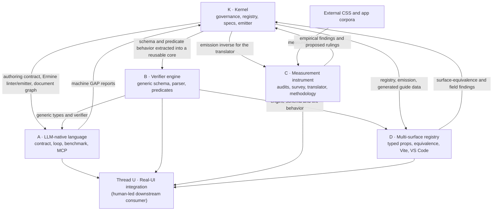
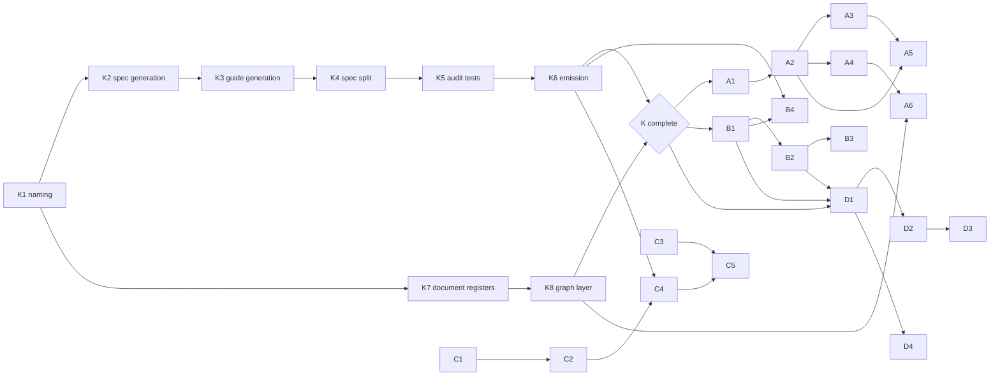

# Ermine project map

This is the as-built map of the completed K, A, B, C, and D work orders. It
explains why this repository contains several projects, where each one lives,
and how data and authority move between them.

For the original strategy and evidence gates, see [DIRECTION.md](DIRECTION.md).
For the task-level specifications, see
[ERMINE-WORK-ORDERS.md](ERMINE-WORK-ORDERS.md). Completing a work order means
its implementation and verification artifacts exist; external evidence gates
such as running a real-model benchmark or collecting the survey sample remain
separate claims and must be reported as such.

## The system in one graph

K is the shared authority and executable vocabulary. B separates the verifier
algebra from Ermine's particular words. A uses that reason-bearing verifier to
support machine authors. C measures external CSS and tests the registry's
assumptions against evidence. D compiles the same registry into practical
authoring and build-tool surfaces. Findings flow back to K only through Gap
Reports and human rulings; no downstream project silently changes the design.

## Shared contracts

The projects meet through a small set of explicit contracts:

| Contract | Source | Main consumers |
|---|---|---|
| Normative design and stable IDs | [`constitution/ERMINE.md`](../constitution/ERMINE.md) and its generated graph | K, A6, all design review |
| Axis vocabulary and scales | [`src/registry.ts`](../src/registry.ts) | K generators, Ermine client, C4, D |
| Generic registry schema and predicates | [`engine/`](../engine/) | Ermine's linter client, B3, D1 |
| Machine authoring context | [`src/LLM-AUTHORING.md`](../src/LLM-AUTHORING.md), shared spec §§1–2, and lint spec §6 | A loop and MCP tools |
| CSS semantics | [`src/emit.ts`](../src/emit.ts) and [`src/css.ts`](../src/css.ts) | A4, C4, D2, D3 |
| Derived property ownership | [`src/ownership.generated.json`](../src/ownership.generated.json) | P7 purity verification |
| Design-change intake | [`reports/`](../reports/) | Constitution author and K governance |

Generated artifacts are guarded by no-diff checks. The root `npm run check`
therefore verifies not just tests and types, but also that the spec, guide,
document graph, ownership data, typed props, editor data, and corpus reports
still agree with their sources.

## K — Kernel

K makes one registry govern code, documentation, and design history without
drift. It is the foundation the other projects share, not a user-facing
surface of its own.

| Orders | What landed |
|---|---|
| K1–K4 | Canonical naming; registry-generated spec and guide sections; separate shared, validator, and machine-authoring documents |
| K5–K6 | Former exploratory audits promoted to tests; emission coverage made executable, with unresolved design questions routed through Gap Reports |
| K7–K8 | Normative, rationale, and history registers with stable IDs; integrity linting; generated reference graph; impact, staleness, and arbitration tools |

Start with the [constitution](../constitution/ERMINE.md), the shared
[machine spec](../src/ERMINE-SPEC.md), and the
[registry](../src/registry.ts). The document-system implementation lives under
[`constitution/`](../constitution/); the executable Ermine client remains under
[`src/`](../src/).

## A — LLM-native language

A treats the class vocabulary as a small language for machine authors. A model
receives a precise contract, emits one class string, and gets reason-bearing
lint feedback until it produces a lawful result or explicitly reports a gap.

| Order | What landed |
|---|---|
| A1 | Bounded authoring contract, output protocol, obligations, and 20 lint-verified intent patterns |
| A2 | Pluggable generate–verify loop, manual and Anthropic adapters, trace recording, and terminal states (`valid`, `gap`, `exhausted`) |
| A3 | Frozen 30-intent benchmark, three comparison arms, metric computation, and report generation |
| A4 | Isolated MCP server exposing lint, emit, and authoring-contract tools |
| A5 | Idempotent conversion of machine `GAP` terminals into human Gap Reports |
| A6 | Graph-aware MCP context retrieval with precedence, staleness, bounded traversal, and whole-node truncation |

Primary locations are [`loop/`](../loop/), [`generators/`](../generators/),
[`bench/`](../bench/), and [`mcp/`](../mcp/). The committed
[`bench/RESULTS.md`](../bench/RESULTS.md) is a deterministic fake-generator run
that proves the benchmark pipeline; it does not claim real-model performance.

## B — Verifier engine

B proves that the verifier is an algebra over registry data rather than a pile
of Ermine-specific conditionals. Ermine is one client; the Tailwind subset is a
second, deliberately different client.

| Order | What landed |
|---|---|
| B1 | Vocabulary-independent parser and P1–P11 predicate machinery exposed through `createLinter` |
| B2 | Public schema documentation and structural registry validation |
| B3 | Tailwind-subset client demonstrating reasoned conflict detection and an honest cascade-order divergence |
| B4 | Property ownership derived from actual emission and consumed by the P7 purity check |

The reusable package is [`engine/`](../engine/). Ermine's
[`src/lint.ts`](../src/lint.ts) is a thin client that binds the generic engine to
Ermine's registry and environment scopes. The independent example is
[`clients/tailwind-subset/`](../clients/tailwind-subset/).

## C — Measurement instrument

C asks whether the assumptions behind a compact styling vocabulary are visible
in real CSS. It can be used independently of Ermine adoption: the audit CLI and
methodology operate on arbitrary stylesheets.

| Order | What landed |
|---|---|
| C1 | Combined local/URL audit CLI built from shared property-coverage and value-distribution logic |
| C2 | Reproducible app-UI corpus, per-target audits, provenance, and cross-corpus findings |
| C3 | Pre-committed density-ordering protocol, offline survey page, tally, and threshold fixtures |
| C4 | One-page CSS-to-Ermine translation spike with snapping, explicit residuals, conservation checks, and browser comparison |
| C5 | Standalone, source-traceable methodology and results write-up |

The instruments and evidence live under [`analysis/`](../analysis/); the survey
lives under [`survey/`](../survey/). The best entry point is
[`measuring-css-scale-adherence.md`](measuring-css-scale-adherence.md), which
links every reported number to a committed source and reproduction command.

## D — Multi-surface registry

D turns the registry into authoring and toolchain surfaces while testing that
they preserve the same semantics. The class-string surface remains the common
interchange form.

| Order | What landed |
|---|---|
| D1 | Generated TypeScript props, canonical `toClassString`, and an explicit per-law enforcement matrix |
| D2 | Paired class/props fixtures whose serialized CSS must be byte-identical |
| D3 | Vite plugin that scans literal class attributes, ignores foreign classes, warns on malformed Ermine compositions, and emits the authored subset |
| D4 | Registry/guide-generated VS Code completions and hovers with a documented manual extension-host smoke test |

The typed API is under [`surfaces/typed/`](../surfaces/typed/), the build plugin
under [`surfaces/vite-plugin/`](../surfaces/vite-plugin/), and editor tooling
under [`surfaces/vscode/`](../surfaces/vscode/). The equivalence property is
permanently exercised by
[`test/equivalence.test.ts`](../test/equivalence.test.ts).

## Dependency sequence

The completed implementation followed these dependency boundaries:

C1–C3 were intentionally able to begin independently: measurement should not
need the styling language to validate itself. C4 is the bridge back to K because
translation requires the emitter's inverse. D waits for both the kernel and the
generic engine schema. A6 is the final A/K join, combining the MCP surface with
the governed document graph.

## Where a change belongs

| If you are changing… | Work in… |
|---|---|
| A law, ruling, rationale, or design decision | K: `constitution/`, via the Gap Report and ruling process |
| Registry vocabulary, scales, or emission | K: `src/registry.ts` / `src/emit.ts`, then regenerate derived artifacts |
| Vocabulary-independent validation behavior | B: `engine/` |
| Model prompts, loop behavior, benchmark mechanics, or agent tools | A: `loop/`, `bench/`, `mcp/` |
| CSS evidence, corpora, survey analysis, or translation measurements | C: `analysis/`, `survey/` |
| Typed, build-tool, or editor authoring experience | D: `surfaces/` |

When a downstream change implies a new design decision, it stops in its own
project and files a Gap Report. K is the only place where that finding can
become a governing rule.
